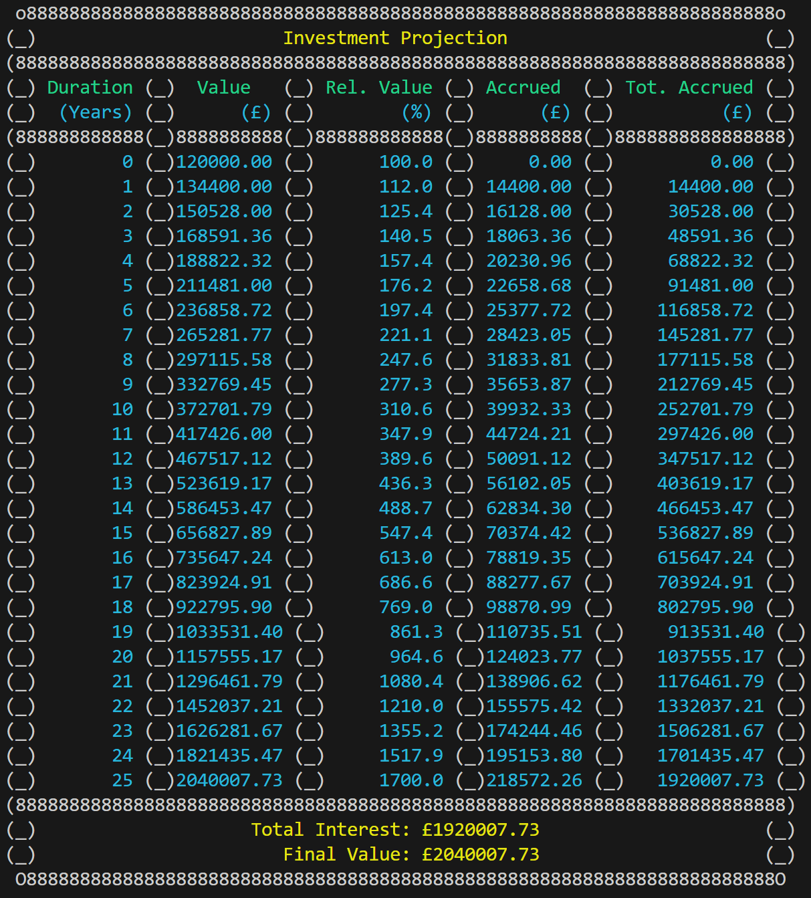

# [Capstone Project](https://github.com/ianhaggerty/finance-calculator-capstone) — [Finance Calculator](https://www.moneysupermarket.com/loans/calculator/)

## [CoGrammar](https://skills.cogrammar.com/) / [HyperionDev](https://www.hyperiondev.com/) / [Portfolio](https://www.hyperiondev.com/portfolio/IH23120012475/)

## Introduction

This repository represents the finance calculator capstone project in the _HyperionDev Data Science (Fundamentals)_ course. The main script can be found [here](https://github.com/ianhaggerty/finance-calculator-capstone/blob/master/finance_calculators.py).

Please see the [project requirements](https://github.com/ianhaggerty/finance-calculator-capstone/blob/master/10-012%20Capstone%20Project%20-%20Variables%20and%20Control%20Structures.pdf) and corresponding [grading](https://hyperiondev.cogrammar.com/review/e5c7d8dde86cc257bf86f39d7edc603f1ea4a96aa7907385d619dae510b42e69/), generously provided by Abdul Gafoor.

## Images





## Math Explainer

Please see [here](https://bit.ly/4aTOhvN) for an exploration of the mathematics involved.

There is further work the be done regarding [changing the interval](https://www.investopedia.com/articles/07/continuously_compound.asp) to which the interest is calculated.

I'm planning to do a video tutorial for those not so acquainted with financial mathematics.

## Usage

1.  Run the main script. (tested on python `3.10.8`)

    ```bash
    python finance_calculators.py
    ```

2.  Follow the prompts!

## A Note from the Author

Thanks for your interest! Please see my [GitHub](https://github.com/ianhaggerty) or [Linkedin](https://www.linkedin.com/in/ihaggerty/) to stay updated.
